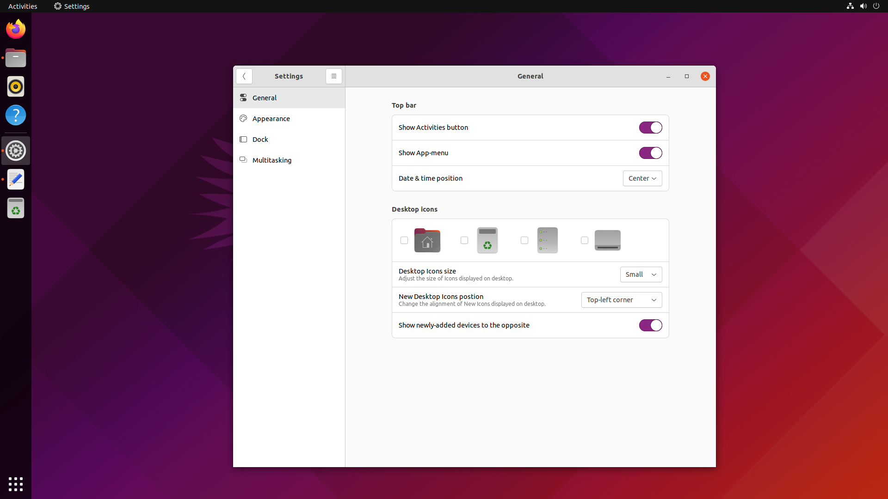
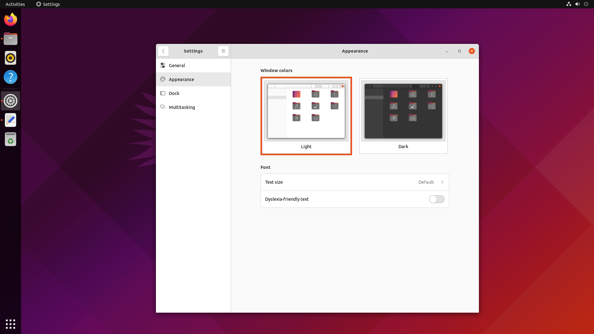
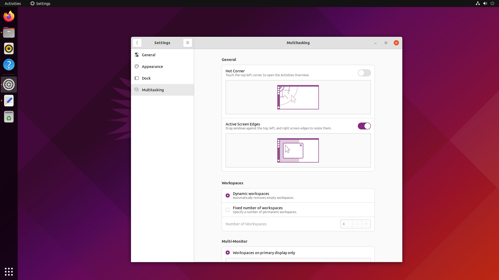

## GNOME Settings
====================

This a fork of GNOME Settings to add the following-panels for [what if? PPA](https://launchpad.net/~muqtxdir-m/+archive/ubuntu/what-if) to ubuntu-desktop:

- Personalize:
  - General
  - Appearance
  - Dock
  - Multitasking


## screenshots:

 ### General:
 

 ### Appearance:
 

 ### Dock:
 

 ### Multitasking:
 

## installation:

```bash
# Add what-if PPA:
sudo add-apt-repository ppa:muqtxdir-m/what-if
# Update and upgrade:
sudo apt update
sudo apt upgrade
```
Reboot and see all the new changes to GNOME Settings
